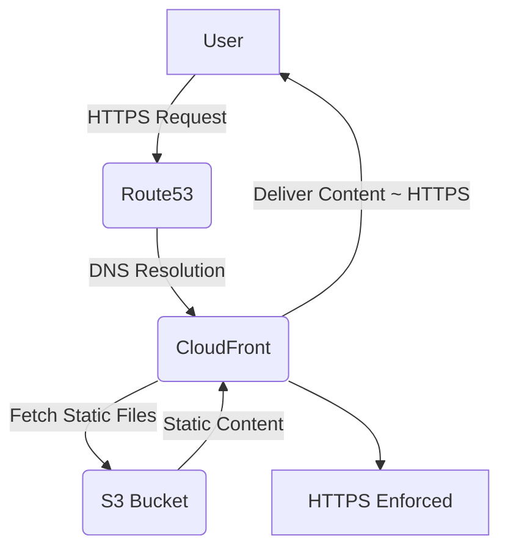

# AWS Static Website Hosting with CloudFormation

[](https://github.com/cbschuld/aws-cf-static-website-hosting-s3-cloudfront-route53/stargazers)
[](LICENSE)


Deploy a secure, scalable static website using S3, CloudFront, and Route53 in minutes!

## Why Use This Template?
- **Fast Setup**: Deploy a production-ready static website in under 10 minutes.
- **Cost-Effective**: Leverages AWS Free Tier-eligible services where possible.
- **Secure**: Enforces HTTPS with CloudFront and custom domain support.
- **Customizable**: Easily tweak parameters for your domain and bucket names.

## CloudFront, S3 and Route53

This repository provides an AWS CloudFormation Template to construct a CloudFront SSL/HTTPS static hosted website from an S3 bucket including the necessary Route53 DNS entries.

You need to have a few things in place for these templates to work:

- A certificate in the AWS Certificate Manager (ACM) for your domain
- A hosted zone in Route53 for your domain



## Determine the Hosted Zone ID

Determine the zone ID using the AWS CLI. In this example I'll use my named profile `example` and look for `example.com`

### Using the AWS CLI

Please note you'll need `jq` for this operation to work.  If you are on MacOS, for example, you can add it with brew: `brew install jq`

```sh
aws route53 list-hosted-zones-by-name --profile=example |
jq --arg name "example.com." \
-r '.HostedZones | .[] | select(.Name=="\($name)") | .Id'
```

### Example output:

```
/hostedzone/Z1UVA2VESUQ1UN
```

## Create a Certificate

Create the certificate in the AWS Certificate Manager (ACM) for your domain. You can use the AWS CLI or the AWS Console. Here is the example for the AWS CLI. You need to know the **domain name** and the **hosted zone ID**.

**NOTE:** I have included two different certificate stacks, one with the wildcard and one without the wildcard.  (eg, if the domain is `domain.com` the wildcard certificate will also include `*.domain.com`)

```sh
aws cloudformation create-stack --stack-name example-com-certificate --template-body file://certificate-with-wildcard.yml \
--parameters \
ParameterKey=DomainName,ParameterValue=example.com \
ParameterKey=HostedZoneId,ParameterValue=Z1UVA3VESUQ1UN \
--region=us-east-1 \
--profile=example
```

You can also use the ZSH script included in the repo as well to create a certificate or a wildcard'ed certificate quickly.

### Using the Stack Template(s)
```

aws cloudformation create-stack --stack-name aztecsoftware-net-static-website --template-body file://static-website.yml \
--parameters \
ParameterKey=DomainName,ParameterValue=example.com \
ParameterKey=AppDomainName,ParameterValue=example.com \
ParameterKey=CertificateARN,ParameterValue=arn:aws:acm:us-east-1:115504476576:certificate/6cb63a42-626f-4cc3-91fd-223c25d45b68 \
--region=us-east-1 \
--profile=example
```


You can also use the ZSH script included in the repo as well to create the website after you have created the certificate and received the ARN from it.

## Use Cases
- Host a personal portfolio or blog.
- Deploy landing pages for startups or campaigns.
- Serve static documentation sites for open-source projects.

## Contributing
Want to improve this template? Submit a pull request or open an issue! We're looking for:
- New features (e.g., ACM certificate automation).
- Documentation enhancements.
- Architecture diagrams or example sites.

## License
This project is licensed under the MIT License. See the [LICENSE](LICENSE) file for details.

## Stay Updated
Star this repo and follow me on [X](https://x.com/cbschuld) for updates!