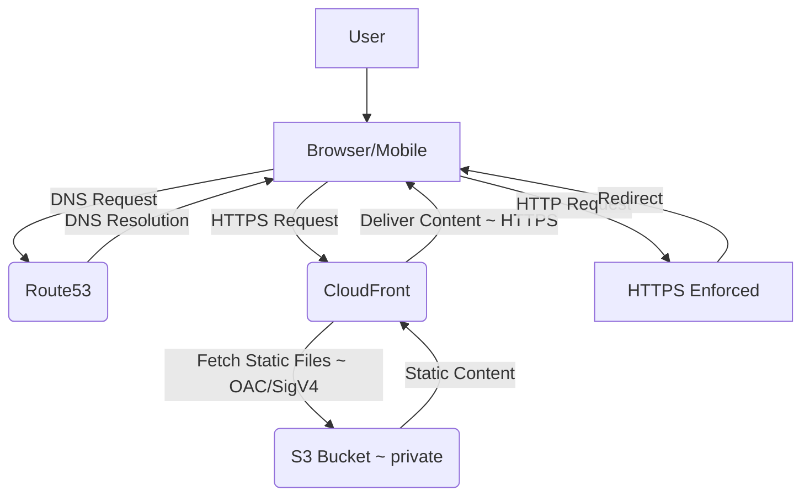

# AWS Static Website Hosting with CloudFormation

[](https://github.com/cbschuld/aws-cf-static-website-hosting-s3-cloudfront-route53/stargazers)
[](LICENSE)

Deploy a secure, scalable static website using S3, CloudFront, and Route53 in minutes.

## Why Use This Template?

- **Fast Setup**: Deploy a production-ready static website in under 10 minutes.
- **Cost-Effective**: Leverages AWS Free Tier-eligible services where possible.
- **Secure**: Private S3 bucket (Origin Access Control + Public Access Block + encryption + TLS-only), HTTPS enforced (TLS 1.2+), and security response headers.
- **Works for SPAs *and* prerendered sites**: pick `spa` or `static`; each gets the routing behavior it actually needs.
- **Customizable**: Parameters for CSP, HSTS, TLS policy, price class, and an optional WAF.

## Architecture


```mermaid
graph TD
    U[User] --> A
    A[Browser/Mobile] -->|DNS Request| B(Route53)
    B -->|DNS Resolution| A
    A -->|HTTPS Request| C(CloudFront)
    C -->|Fetch Static Files ~ OAC/SigV4| D(S3 Bucket ~ private)
    D -->|Static Content| C
    C -->|Deliver Content ~ HTTPS| A
    A -->|HTTP Request| E[HTTPS Enforced]
    E -->|Redirect| A
```

## Prerequisites

- An AWS account and a named AWS CLI profile
- A Route53 **public** hosted zone for your domain
- `aws`, `jq`, and `bash`. On macOS: `brew install awscli jq`

## Quick start

```bash
# 1. Certificate (always us-east-1 - the script enforces this)
./create-certificate.sh                 # or ./create-certificate-with-wildcard.sh

# 2. Website stack (any region - put it near your users)
./create-static-website.sh

# 3. Upload your site (the previous step prints this exact command)
./deploy-content.sh ./dist <bucket> <distribution-id> <profile> <region>
```

Each script prompts for what it needs, looks up the hosted zone itself, validates
your input against AWS, and shows a summary before doing anything.

### Doing it by hand

```bash
aws cloudformation deploy \
  --stack-name example-com-certificate \
  --template-file certificate-with-wildcard.yml \
  --parameter-overrides DomainName=example.com HostedZoneId=Z1UVA2VESUQ1UN \
  --region us-east-1 --profile example

aws cloudformation deploy \
  --stack-name example-com-static-website \
  --template-file static-website.yml \
  --parameter-overrides \
    AppDomainName=www.example.com \
    HostedZoneId=Z1UVA2VESUQ1UN \
    CertificateARN=arn:aws:acm:us-east-1:123456789012:certificate/00000000-0000-0000-0000-000000000000 \
    SiteType=static \
  --no-fail-on-empty-changeset \
  --region us-west-2 --profile example
```

To find your hosted zone ID by hand:

```bash
aws route53 list-hosted-zones-by-name --profile=example |
jq -r '.HostedZones[] | select(.Name=="example.com.") | .Id'
```

## Choosing `SiteType`

| | `spa` | `static` |
|---|---|---|
| For | React/Vue/Svelte with a client-side router | Hugo, Jekyll, Astro, plain HTML |
| Missing page | serves `/index.html` with **200** | returns a real **404** |
| `/about/` | handled by your router | rewritten to `/about/index.html` |

`static` adds a CloudFront Function that appends `index.html` to URLs ending in
`/`. It deliberately does **not** rewrite extensionless URLs, so files like
`/LICENSE`, `/robots` and `/CNAME` are still served as themselves.

Both modes grant CloudFront `s3:ListBucket`. Without it S3 answers **403** for a
missing key rather than 404, so a static site could never return a real 404 and a
genuine permissions failure would be indistinguishable from a typo'd URL.

## Parameters

| Parameter | Default | Notes |
|---|---|---|
| `AppDomainName` | — | The site's FQDN, e.g. `www.example.com` |
| `HostedZoneId` | — | Route53 zone that owns the domain |
| `CertificateARN` | — | ACM cert, **must** be `us-east-1` |
| `SiteType` | `spa` | `spa` or `static` — see above |
| `PriceClass` | `PriceClass_100` | Cost decision; `_All` for global reach |
| `MinimumProtocolVersion` | `TLSv1.2_2025` | `TLSv1.3_2025` drops TLS 1.2 entirely |
| `ContentSecurityPolicy` | restrictive subset | Empty string omits the header |
| `PermissionsPolicy` | *(empty)* | e.g. `camera=(), microphone=()` |
| `HstsIncludeSubdomains` | `false` | **Read the HSTS note below** |
| `HstsPreload` | `false` | **Read the HSTS note below** |
| `WebACLArn` | *(empty)* | From `waf-us-east-1.yml`, if you want one |
| `ProjectTag` | *(empty)* | Adds a `Project` tag to billable resources |

## Security notes

The bucket is **fully private**: Public Access Block (all four flags), ACLs
disabled (`BucketOwnerEnforced`), default SSE-S3 encryption, versioning on, and a
bucket policy that **denies all non-TLS requests**. CloudFront is the only reader,
via **Origin Access Control** scoped by `AWS:SourceArn` to this distribution
alone. CloudFront enforces HTTPS (`redirect-to-https`, TLS 1.2+, `sni-only`) and
attaches a response-headers policy.

`X-XSS-Protection` is deliberately **not** sent — it is deprecated, modern
browsers ignore it, and the legacy auditor it enabled introduced its own
vulnerabilities.

### The default CSP is opinionated, not risk-free

`base-uri 'self'; object-src 'none'; frame-ancestors 'none'` restricts nothing
about scripts, styles, or images, so it is safe for the large majority of static
sites. It **will** break a site that uses a cross-origin `<base>`, serves
`<object>`/`<embed>` content, or expects to be embedded in a partner's iframe.
Override the `ContentSecurityPolicy` parameter, or set it to `""` to omit it.

### HSTS: `includeSubDomains` is the dangerous one

Both HSTS options default to `false` on purpose.

- **`HstsIncludeSubdomains`** is the one that bites. On an **apex** domain it
  forces HTTPS on *every* subdomain — including internal hosts that may have no
  certificate — from the moment a browser sees the header.
- **`HstsPreload`** does nothing on its own; someone must submit the domain at
  [hstspreload.org](https://hstspreload.org). Removing the directive later does
  **not** remove a domain browsers have already shipped in their preload list.

The `max-age` is two years, which is what preload submission requires.

### Not included by default

Access logging and WAF live in separate stacks (see below). There is no origin
failover and no geo restriction.

## Optional: access logging

```bash
aws cloudformation deploy --stack-name example-com-logs \
  --template-file logging-us-east-1.yml \
  --parameter-overrides DistributionArn=<DistributionArn output> \
  --region us-east-1 --profile example
```

Uses CloudFront **standard logging v2**, which grants access by bucket policy
rather than ACLs — ACLs are disabled by default on buckets created since April
2023. Logs go to a dedicated bucket, never the origin bucket.

## Optional: WAF

```bash
aws cloudformation deploy --stack-name example-com-waf \
  --template-file waf-us-east-1.yml \
  --region us-east-1 --profile example
# then redeploy the website stack with WebACLArn=<WebACLArn output>
```

**Consider whether you need this.** On a GET/HEAD-only static site with an S3
origin, the AWS managed rule groups mostly guard against injection classes this
stack cannot suffer — there is no application server and no database. A
rate-based rule counts every asset request, so one visitor loading 40 files
counts 40 times and everyone behind a corporate NAT shares a counter. Shield
Standard already protects CloudFront for free. Budget **well above** the ~$5/month
base: rules and requests are billed on top.

## Why logging and WAF are separate stacks

Both must be created in `us-east-1` — WAFv2 because `Scope: CLOUDFRONT` requires
it, and CloudFront log delivery because the CloudWatch Logs API only accepts it
there, even for cross-region destinations. The website stack is intentionally
region-flexible so your S3 origin can sit near your users. Folding these in
behind an `Enable...` flag would produce a template that deploys fine everywhere
and then fails *only* for users who turn the flag on *outside* us-east-1.

## Upgrading from an earlier version of this template

Three **breaking changes**. New deployments are unaffected.

1. **`DomainName` → `HostedZoneId`.** The template took a root domain name and
   resolved the zone by name, which is ambiguous when a private and a public zone
   share a domain. Pass the zone ID instead.
2. **The bucket name is now generated.** It used to be `AppDomainName`. S3 bucket
   names are globally unique across *all* AWS accounts, so owning a domain gives
   you no claim on the matching bucket name — deployments failed for reasons users
   could not fix. With OAC the origin is addressed by its regional domain name, so
   the bucket name was never user-visible anyway.

   ⚠️ **Changing `BucketName` replaces the bucket.** Do not apply this to a live
   stack without migrating content first:
   ```bash
   aws s3 sync s3://old-bucket s3://new-bucket
   ```
   The old bucket has `DeletionPolicy: Retain`, so it is kept, not deleted.
3. **SPA mode no longer rewrites 403.** Only 404 is served `/index.html`. Because
   `s3:ListBucket` is now granted, a 403 means a *real* authorization failure
   rather than a missing file — masking it as a 200 page hid broken bucket
   policies and OAC misconfigurations.

## Teardown

The bucket is versioned and set to `Retain`, so it survives stack deletion and
must be emptied explicitly. Deleting current objects only adds delete markers:

```bash
aws s3 rm s3://<bucket> --recursive --profile example   # current objects
aws s3api delete-objects --bucket <bucket> --profile example \
  --delete "$(aws s3api list-object-versions --bucket <bucket> --profile example \
    --query '{Objects: [].{Key:Key,VersionId:VersionId}}' --output json)"
aws cloudformation delete-stack --stack-name <stack> --profile example
```

## Development

```bash
cfn-lint ./*.yml
shellcheck ./*.sh
```

Both run in CI on every pull request.

## Use Cases

- Host a personal portfolio or blog.
- Deploy landing pages for startups or campaigns.
- Serve static documentation sites for open-source projects.

## Contributing

Want to improve this template? Submit a pull request or open an issue.

## License

This project is licensed under the MIT License. See the [LICENSE](LICENSE) file for details.

## Stay Updated

Star this repo and follow me on [X](https://x.com/cbschuld) for updates!
